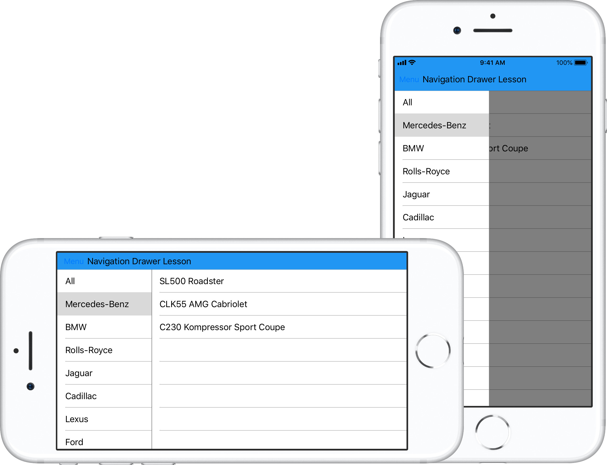

<!-- default badges list -->

<!-- default badges end -->
# Xamarin.Forms Navigation Views: Getting Started Lesson 3

This repository stores the application from the [Xamarin Forms Navigation Views Lesson 3: Create the Drawer View](https://docs.devexpress.com/MobileControls/400663/xamarin-forms/navigation-controls/getting-started/how-to-use-drawer-view) lesson. This lesson explains how to add a [Drawer View](https://docs.devexpress.com/MobileControls/DevExpress.XamarinForms.Navigation.DrawerView) to your Xamarin.Forms application:

